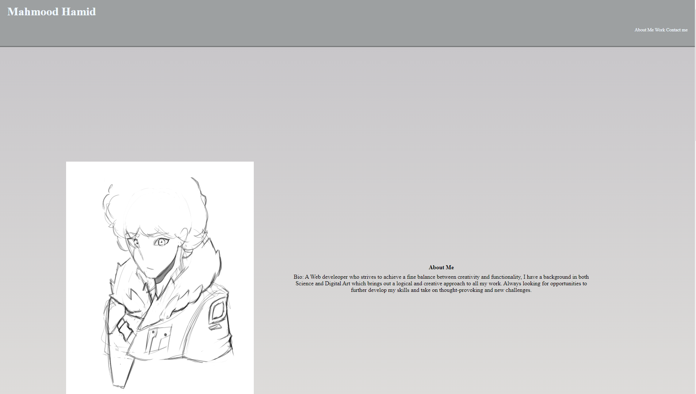
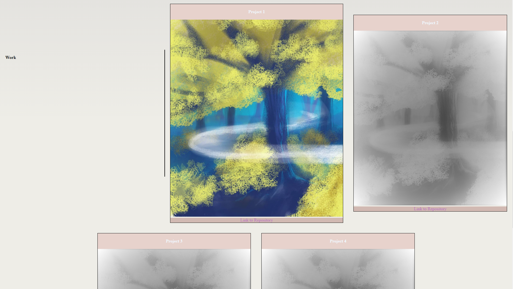
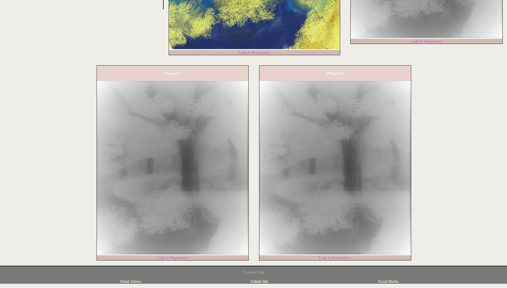

# My Portfolio

## Description
I created a portfolio page for my future work and projects throughout my course. I will be updating the portfolio to fit new projects as I complete them. I created both code for html and css to structure and style my portfolio. I also added css properties to make the portfolio page responsive to different screen sizes.

## Screenshots

## Link to Deployed application

https://mahmoodrm.github.io/my-portfolio/